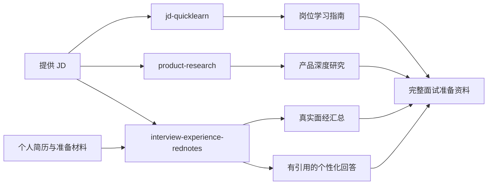

# JD to Interview All in One

> 从读懂 JD、研究岗位相关产品，到收集真实面经并准备个人回答的一站式非技术岗面试准备工具箱。

[](LICENSE)


`jd-to-interview-all-in-one` 集成三个可以独立使用、也可以串联工作的 Codex Skills，面向产品、运营、销售、商务、设计、市场、职能和管培生等非技术岗位。

用户只需提供一份 JD，即可逐步完成：

1. 理解岗位、部门和需要补齐的知识；
2. 深入研究岗位涉及的产品、业务与竞品；
3. 收集小红书真实面经，整理常见问题；
4. 根据个人简历和准备材料生成有引用依据的回答。

## 完整工作流



三个 Skill 没有强制执行顺序，也不要求全部使用。你可以先用 `jd-quicklearn` 建立岗位认知，再根据需要研究产品或采集面经；如果已经熟悉岗位，也可以直接运行后两个模块。

## 包含的 Skills

| Skill | 解决的问题 | 主要输出 |
|---|---|---|
| [`jd-quicklearn`](skills/jd-quicklearn/) | 这个岗位到底做什么，我需要补哪些知识？ | 岗位学习指南 Markdown |
| [`product-research`](skills/product-research/) | 相关产品、竞品和业务逻辑是什么？ | 产品深度研究与来源汇总 |
| [`interview-experience-rednotes`](skills/interview-experience-rednotes/) | 真实面试会问什么，我该如何结合自身经历回答？ | 面经汇总与个性化回答的 Markdown、Word、HTML |

### 1. JD QuickLearn：快速理解陌生岗位

将 JD 翻译成零基础也能读懂的岗位学习指南，重点解决“看得懂岗位名称，但不知道实际工作内容”的问题。

它会：

- 解析公司与团队介绍、岗位职责和任职要求；
- 识别岗位级别、协作对象、业务阶段和考核方式等隐含信息；
- 将 JD 术语翻译成实际工作内容；
- 核验公司、产品、团队和行业的最新公开信息；
- 拆解硬技能、分析方法与软技能；
- 根据可用时间给出有优先级的学习路径。

默认输出五部分：

1. 岗位基础介绍；
2. 公司、部门及业务背景；
3. 核心知识体系；
4. 技能拆解；
5. 学习路径。

该 Skill 专注于岗位理解和知识补齐，不生成或收集面试题库、历史真题、预测题及答题框架。

### 2. Product Research：深度研究相关产品

将一个 B 端或 C 端软件产品研究成有证据、可追溯、适合面试表达的结构化报告。既可以直接指定产品，也可以让 Skill 从 JD 中识别需要重点研究的业务和产品。

默认研究内容包括：

- 产品归属、定位、用户、规模与营收口径；
- 版本迭代、重大事件与战略演进；
- 用户、场景、功能、商业模式、生态与护城河；
- 主要竞品及其本质差异；
- AI 战略、能力布局与竞争差异；
- 三条可在面试中简洁表达的关键产品观点。

研究会区分官方事实、媒体转述、行业估算和分析判断，并为关键数据保留来源、日期与证据等级。

### 3. Interview Experience Rednotes：采集真实面经并准备回答

根据 JD 从小红书公开内容中搜索、筛选、下载和整理个人面经，适用于产品、运营、销售、设计、市场、职能及管培生等非技术岗位。

它会：

- 从 JD 提取公司、业务线、岗位和招聘类型并生成搜索词；
- 跳过视频、重复内容、明显卖课引流和无个人经历的通用题库；
- 保存帖子原文、发布时间、原帖链接与全部图片；
- 使用本地 PaddleOCR 提取图片文字；
- 按 AI 面、群面、一面、二面、三面和 HR 面整理问题；
- 按求职动机、项目经历、岗位专业、业务理解、案例题和行为题等分类；
- 输出带来源引用的 Markdown、Word 和本地 HTML 面经汇总。

如果同时提供个人简历和面试准备材料，还会生成个性化回答，并分别引用面经来源和个人材料依据。信息不足时会明确提示，不会虚构项目、职责、指标或结果。

## 安装

克隆仓库：

```bash
git clone https://github.com/yangming1768-alt/jd-to-interview-all-in-one.git
```

将 `skills/` 下需要使用的一个或多个目录复制到 Agent 的 Skills 目录。Codex 的典型位置为：

```text
%USERPROFILE%\.codex\skills\       # Windows
~/.codex/skills/                    # macOS / Linux
```

安装全部三个 Skill 后的目录示例：

```text
~/.codex/skills/
├── jd-quicklearn/
├── product-research/
└── interview-experience-rednotes/
```

也可以保留在项目目录中，让 Agent 直接读取对应的 `SKILL.md`。不同 Agent 的 Skill 安装与触发方式可能不同，请以所用产品的说明为准。

### 面经采集的额外环境

`jd-quicklearn` 和 `product-research` 不需要本项目提供额外的本地运行环境。

`interview-experience-rednotes` 当前优先支持 Windows，首次运行会引导准备独立环境，包括 Node.js、OpenCLI、Python、PaddleOCR 和文档转换依赖，并检查 Chrome 与 OpenCLI 浏览器扩展的连接。安装扩展及登录小红书需要用户本人完成。

## 使用示例

### 只理解岗位

```text
使用 jd-quicklearn 分析这份 JD，帮我从零理解岗位、部门业务、核心知识和需要补齐的技能。
```

### 深入研究产品

```text
使用 product-research 深度研究抖音支付，重点分析用户场景、增长价值、竞品差异和战略位置，用于产品经理面试。
```

### 收集真实面经

```text
使用 interview-experience-rednotes，根据这份 JD 收集小红书真实面经，并生成 Markdown、Word 和 HTML 汇总。
```

### 完整使用三个 Skill

```text
这是我的 JD。先使用 jd-quicklearn 帮我理解岗位，再使用 product-research 研究岗位相关产品，最后使用 interview-experience-rednotes 收集真实面经。

这是我的简历和面试准备材料，请在面经汇总后继续生成有引用的个性化回答。
```

## 质量与信任边界

- 最新公司、产品和行业事实优先使用可靠公开来源，并注明日期；
- 区分公开事实、合理推断、行业估算和信息缺口；
- 找不到可靠证据时明确写明“公开信息不足”，不编造数据；
- 面经帖子视为作者个人自述，不代表公司官方流程；
- 小红书采集保持只读，不点赞、收藏、关注、发布或发送私信；
- 不索要密码、Cookie、token 或验证码，不绕过验证码和风控；
- 简历、准备材料和图片 OCR 均在本地处理，不将个人材料上传到第三方 OCR；
- 个性化回答只使用用户材料能够支持的事实，不把他人经历写成用户经历。

## 项目结构

```text
jd-to-interview-all-in-one/
├── README.md
├── LICENSE
└── skills/
    ├── jd-quicklearn/
    ├── product-research/
    └── interview-experience-rednotes/
```

每个目录都是独立 Skill，包含自己的 `SKILL.md` 和运行所需资源。

## 独立项目

- [jd-quicklearn](https://github.com/yangming1768-alt/jd-quicklearn)
- [product-research](https://github.com/yangming1768-alt/product-research)
- [interview-experience-rednotes](https://github.com/yangming1768-alt/interview-experience-rednotes)

## 开源协议

本项目采用 [MIT License](LICENSE)。各 Skill 使用的第三方依赖分别遵循其自身许可证。
