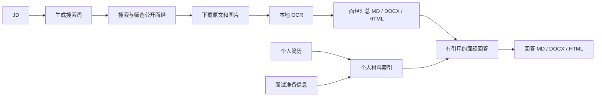
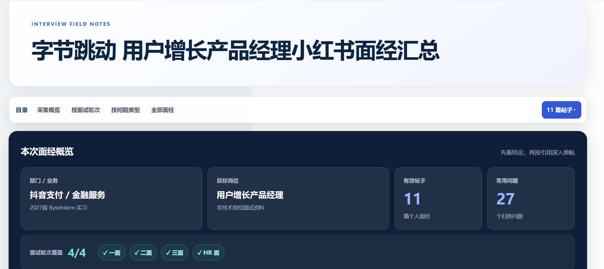
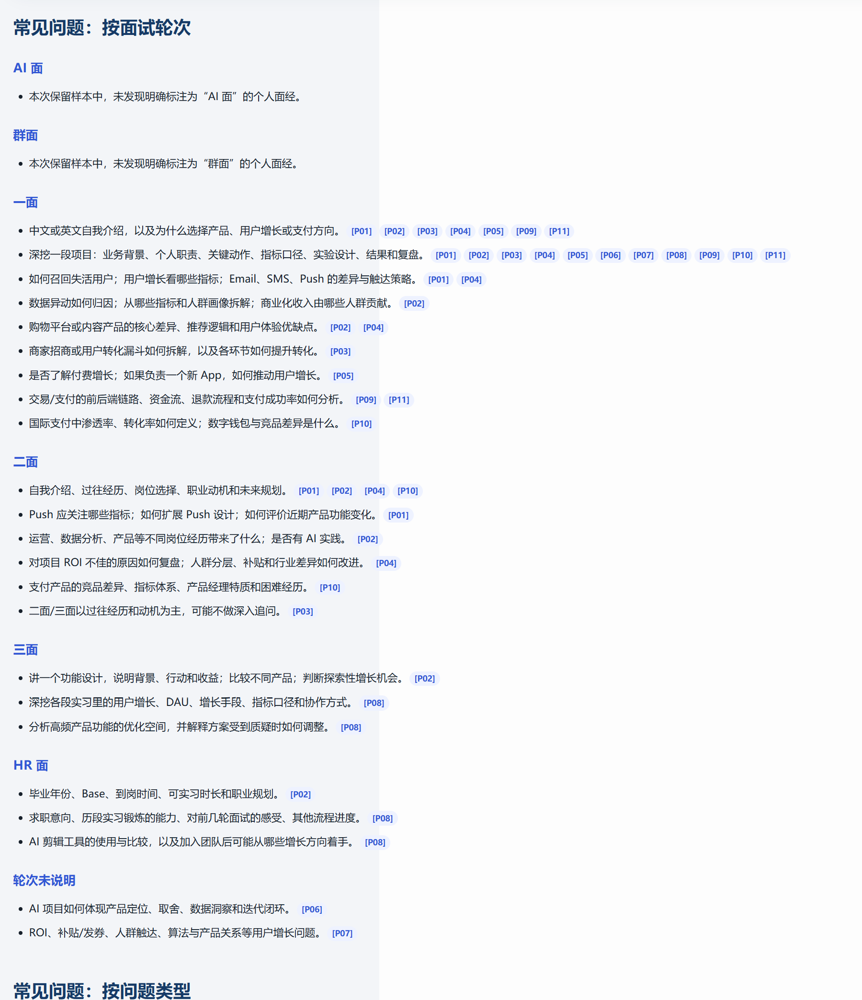
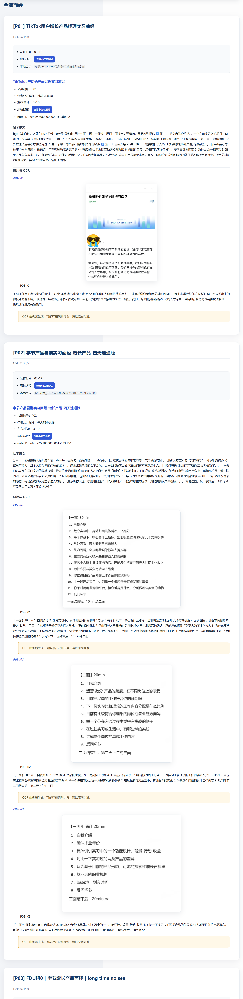

# 小红书面经采集与回答 Skill

面向产品、运营、销售、设计、市场、职能和管培生等非技术岗位的面试准备 Skill。

用户提供 JD 后，Agent 会从小红书公开内容中搜索、筛选、下载并整理个人面经；如果同时提供个人简历和面试准备材料，还会继续生成有来源、有个人依据的面经回答。

## 能做什么

- 从 JD 提取公司、业务线、岗位和招聘类型，自动生成搜索词。
- 检查每个搜索词默认排序前 10 条结果，跳过视频、重复内容和明显卖课引流。
- 保存帖子原文、发布时间、原帖链接和全部图片。
- 使用本地 PaddleOCR 提取图片文字，不把图片上传到第三方 OCR。
- 按 AI 面、群面、一面、二面、三面、HR 面整理问题。
- 按求职动机、项目经历、岗位专业、业务理解、案例题、行为题等分类。
- 输出 Markdown、Word 和本地 HTML 三种面经汇总。
- 根据简历和准备材料生成个性化回答，并为问题来源和个人依据添加引用。

## 工作流程



## 效果示例

以下示例使用“字节跳动｜抖音支付 / 金融服务｜用户增长产品经理｜2027 届 ByteIntern 实习”JD。公开示例已清理小红书签名参数和本机路径；完整输出包含 11 篇有效帖子、35 张图片和 27 个归类问题。

<details>
<summary><strong>查看示例输入 JD</strong></summary>

### 用户增长产品经理

**职位描述**

ByteIntern：面向 2027 届毕业生（2026 年 9 月—2027 年 8 月期间毕业），为符合岗位要求的同学提供转正机会。

团队介绍：依托抖音集团的科技能力和产品，我们为抖音电商、生活服务、直播等场景提供金融服务，为抖音用户提供更好的支付、消费金融、保险等金融服务。科技创新，普惠大众。

1. 对业务数据进行分析及问题挖掘，跟进数据分析需求，归因数据变化，挖掘增长机会；
2. 支持用户增长策略（营销/算法等）的实验方案设计、上线、效果回收；
3. 增长策略实验的分层管理、开启、监控、关闭，通过合理的实验分配提升算法实验迭代的效率。

**职位要求**

1. 2027 届本科及以上学历在读，计算机、统计等相关专业优先；
2. 有敏锐的业务意识，以及较强的自驱力，以目标结果为导向，有团队协作意识，能够积极推动业务合作落地；
3. 有优秀的学习能力以及数据分析能力，比较细心且逻辑思维能力强，资源整合能力佳；
4. 具备较好的跨团队协调沟通能力，以及较好的执行力与抗压性。

</details>

### 示例输出下载

- [Markdown：面经汇总.md](examples/byteintern-user-growth-product-manager/面经汇总.md)
- [Word：面经汇总.docx](examples/byteintern-user-growth-product-manager/面经汇总.docx?raw=1)
- [HTML：面经汇总.html](examples/byteintern-user-growth-product-manager/面经汇总.html?raw=1)

HTML 和 Markdown 使用 `images/` 中的相对图片。克隆或下载仓库后，请保持示例目录结构，并在本地打开 HTML；Word 文件已内嵌图片，可单独下载。

### 页面效果

#### 岗位、帖子、问题和轮次概览



#### 按面试轮次整理问题，引用可跳转



#### 帖子原文、图片和 OCR 归档



## 输入方式

JD 是唯一必填项，支持直接粘贴文本或提供本地文件。

首次使用可以提供：

1. JD；
2. 个人简历，可选；
3. 面试准备信息，可选，例如自我介绍、项目复盘、求职动机、职业规划、优势与短板、失败经历、协作案例、岗位理解或已经写过的回答。

如果只有 JD，Skill 会先完成面经汇总，再提醒用户补充个人材料。后续补充材料时会复用已有面经，不重新搜索和下载。

示例提示词：

```text
使用 $interview-experience-rednotes，根据这个 JD 收集小红书真实面经。
这是我的简历和面试准备信息，请在汇总后继续生成有引用的个性化回答。
```

## 输出内容

一个 JD 对应一个本地任务目录：

```text
公司_业务线_岗位_招聘类型/
├── JD.md
├── 面经汇总.md
├── 面经汇总.docx
├── 面经汇总.html
├── 个人材料索引.md       # 提供个人材料时生成
├── 面经回答.md           # 提供个人材料时生成
├── 面经回答.docx
├── 面经回答.html
└── 帖子/
    ├── P01_帖子标题/
    │   ├── 帖子.md
    │   ├── metadata.json
    │   ├── ocr-results.json
    │   └── 图片/
    └── P02_帖子标题/
```

### 面经汇总

- 汇总所有通过筛选的帖子，不设置 10 条上限。
- 最终少于 8 条时提示信息有限，不用弱相关内容凑数。
- 每个问题保留 `[P01]`、`[P01-I01]` 等来源编号。
- HTML 使用电脑宽屏布局、概览卡片、单横排常驻目录和可跳转引用。

### 面经回答

每个问题标记为：

- `可直接回答`：个人材料足以支持回答；
- `部分信息`：有相关经历，但缺少关键事实；
- `材料不足`：现有材料不能支持个人化陈述。

问题使用 `[Q01]` 编号，面经来源使用 `[P01]`，简历依据使用 `[R01]`，准备材料使用 `[M01]`，必要的公开资料使用 `[W01]`。

Skill 不会把面经作者的经历写成用户经历，也不会虚构项目、职责、指标或结果。材料不足时只提供分析框架和准备方向，由本人判断和补充。

## 环境要求

当前优先支持 Windows。

一键部署会在 `%LOCALAPPDATA%\RednoteInterviewSkill\` 中准备独立环境，包括：

- Node.js；
- [OpenCLI](https://github.com/jackwener/OpenCLI)；
- Python 与 PaddleOCR；
- Word/HTML 转换依赖；
- Chrome 检查与 OpenCLI 浏览器扩展连接。

不会修改系统 PATH，也不会污染用户现有 Python 环境。Chrome 扩展安装和小红书登录需要用户本人完成。

## 安装为 Agent Skill

将整个 `interview-experience-rednotes` 目录放入 Agent 的 skills 目录，并确保 Agent 能读取其中的 `SKILL.md`。

Codex 的典型位置：

```text
%USERPROFILE%\.codex\skills\interview-experience-rednotes\
```

也可以保留在项目目录中，由 Agent 直接读取 `SKILL.md`。不同 Agent 的 Skill 安装方式可能不同，请以对应产品说明为准。

## 信任与隐私边界

- 只读取小红书公开内容，不采集评论和作者回复。
- 不点赞、不收藏、不关注、不发布、不发私信。
- 不读取或索要密码、Cookie、token 和验证码。
- 不绕过验证码、风控、登录限制或浏览器安全机制。
- 个人简历和图片只在本地处理，不上传第三方 OCR。
- 生成文档会忽略电话、邮箱、住址、证件号等无关隐私。
- 出现登录失效或安全验证时立即暂停，由用户处理后继续。

## 项目结构

```text
interview-experience-rednotes/
├── SKILL.md
├── agents/openai.yaml
├── assets/                  # 输出模板
├── references/              # 采集、部署和回答规范
└── scripts/
    ├── deployment/windows/  # Windows 一键部署
    ├── ocr_images.py
    ├── validate_output.py
    └── validate_answers.py
```

## 已知限制

- 目前只完成 Windows 一键部署流程。
- 小红书页面、风控策略和 OpenCLI 适配器变化可能导致采集暂时不可用。
- 原帖可能更新或删除；文档保留采集时的公开内容和来源链接。
- 帖子属于作者自述，不代表公司官方流程，也不等于独立核验的事实。
- 生成的面经回答是准备草稿，所有“部分信息”“材料不足”和“需本人补充”内容都必须由本人确认。

## 相关项目

- [OpenCLI](https://github.com/jackwener/OpenCLI)
- [OpenCLI 小红书适配器](https://opencli.info/docs/adapters/browser/xiaohongshu.html)
- [PaddleOCR](https://github.com/PaddlePaddle/PaddleOCR)

## 开源协议

本项目采用 [MIT License](LICENSE)。第三方依赖分别遵循其自身许可证。
